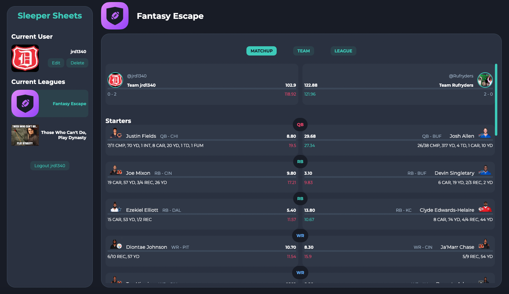
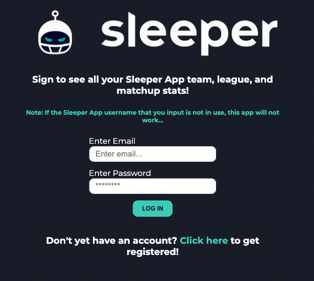
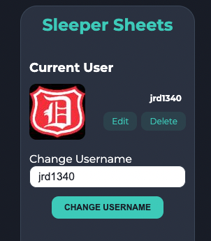

# Sleeper Sheets
Sleeper Sheets is a full-stack MERN fantasy football application that consumes the Sleeper API to grab a user's Sleeper teams, leagues, stats, projections, etc. and display that data to the user. Sleeper currently has their own web application that does all of this, but I wanted to display that information in my own way and improve upon the design.

## Links to Project
[Sleeper Sheets Frontend - Github](https://github.com/siemenjm/frontend-sleeper-sheets)

[Sleeper Sheets Backend - Github](https://github.com/siemenjm/backend-sleeper-sheets)

[Sleeper Sheets - Netlify Deployment](https://funny-dango-f7628e.netlify.app/)

[Sleeper Sheets - Heroku Deployment](https://backend-sleeper-sheets.herokuapp.com/)



## MVP User Stories
As a user, I want to be able to:
* Create an account and be able to log in/out
* See my data for each league that I participate in
* View my matchup for the current week
* View my current players in more detail
* View the current scores/matchups around the rest of the league
* Change which league that I am currently viewing
* Navigate through the views easily

## Getting Started
To use Sleeper Sheets, you first need to either log in to your account, or create one using an email, password, and your Sleeper App username. Note: You need to have an account on the Sleeper App in order for this to work.



Once logged in, you will see a page displaying your user info, the leagues that you are in, the current league, and the current matchup in that league. You are then able to view other data by clicking on the "Matchup", "Team", or "League" links in the center of the page. If you would like to view data from a different league that you are in, simply click on that league in the sidebar.


You can also edit your Sleeper App username if you changed it in the Sleeper App, or if you just want to take a look at your friend's data. Do this by clicking the "Edit" button next to your avatar in the sidebar. If you'd like to delete your account for any reason, there is also a "Delete" button in the same spot.



## Sleeper API
Here are links to the Sleeper App and the Sleeper API that Sleeper Sheets consumes to get all the fantasy data:

[Sleeper App](https://sleeper.com/)

[Sleeper API](https://docs.sleeper.app/)

To get all their data, a user will first have to enter their Sleeper App username when registering, which will get their "user_id" via <code>GET https://api.sleeper.app/v1/user/?username</code>.
```JSON
{
  "username": "sleeperuser",
  "user_id": "12345678",
  "display_name": "SleeperUser",
  "avatar": "cc12ec49965eb7856f84d71cf85306af"
}
```

Now that we have the "user_id", we can get all the leagues for that user via <code>GET https://api.sleeper.app/v1/user/?user_id/leagues/?sport/?season</code>.

```JSON
[
  {
    "total_rosters": 12,
    "status": "pre_draft", // can also be "drafting", "in_season", or "complete"
    "sport": "nfl",
    "settings": { settings object },
    "season_type": "regular",
    "season": "2018",
    "scoring_settings": { scoring_settings object },
    "roster_positions": [ roster positions array ],
    "previous_league_id": "198946952535085056",
    "name": "Sleeperbot Friends League",
    "league_id": "289646328504385536",
    "draft_id": "289646328508579840",
    "avatar": "efaefa889ae24046a53265a3c71b8b64"
  },
  {
    "total_rosters": 12,
    "status": "in_season",
    "sport": "nfl",
    "settings": { settings object },
    "season_type": "regular",
    "season": "2018",
    "scoring_settings": { scoring_settings object },
    "roster_positions": [ roster positions array ],
    "previous_league_id": "198946952535085056",
    "name": "Sleeperbot Dynasty",
    "league_id": "289646328504385536",
    "draft_id": "289646328508579840",
    "avatar": "efaefa889ae24046a53265a3c71b8b64"
  },
]
```

This gives us "league_id". Once we have "league_id", we can access all the league rosters, users, matchups, transactions, and draft information. For example, matchups can be retrieved via <code>GET https://api.sleeper.app/v1/league/!league_id/matchups/!week</code>.

```JSON
[
  {
    "starters": ["421", "4035", "3242", "2133", "2449", "4531", "2257", "788", "PHI"],
    "roster_id": 1,
    "players": ["1352", "1387", "2118", "2133", "2182", "223", "2319", "2449", "3208", "4035", "421", "4881", "4892", "788", "CLE"],
    "matchup_id": 2,
    "points": 20.0 // total points for team based on league settings
    "custom_points": null // if commissioner overrides points manually
  },
  ...
]
```
Two teams with the same matchup ID will be the teams facing each other.

You'll also notice that players are represented by a number. In order to get a player's info such as name, team, etc., we need to fetch a list of all the players. According to the documentation, this is a large file that should be updated no more than once per day due to it's size and the fact that it won't change very often. All the players will be fetched via <code>GET https://api.sleeper.app/v1/players/nfl</code>.

All stats and projections will be retrieved via <code>GET https://api.sleeper.app/v1/?stats/?nfl/?season-type/?season/?week</code> and <code>GET https://api.sleeper.app/v1/?projections/?nfl/?season-type/?season/?week</code>. For example:

```JSON
{
    "8465": {
        "tm_st_snp": 22.0,
        "tm_off_snp": 68.0,
        "tm_def_snp": 58.0,
        "st_snp": 2.0,
        "penalty_yd": 5.0,
        "penalty": 1.0,
        "off_snp": 68.0,
        "gs": 1.0,
        "gp": 1.0,
        "gms_active": 1.0
    },
    "6177": {
        "tm_st_snp": 20.0,
        "tm_off_snp": 70.0,
        "tm_def_snp": 57.0,
        "idp_tkl_solo": 1.0,
        "idp_tkl_ast": 1.0,
        "idp_tkl": 2.0,
        "gp": 1.0,
        "gms_active": 1.0,
        "def_snp": 16.0
    }, ...
```

## Technologies Used
* React
* Node.js
* Express.js
* Mongoose and MongoDB
* bcryptJS
* JavaScript
* CSS

## Stretch Goals
The biggest stretch goal that I would like to achieve is adding CRUD functionality to the app in an "Advanced Fantasy Tools" section. This would give a user the ability to manipulate their lineups, look for trade opportunities, and other data manipulation features.

Other stretch goals would include:
* View the current league standings
* View league transactions
* View a list/rankings of all the players
* mobile responsiveness
* user auth
* advanced styling

## Want to Contribute?
If you notice any of the many bugs, or have feature suggestions, please reach out to me at contact@jaredsiemen.com.